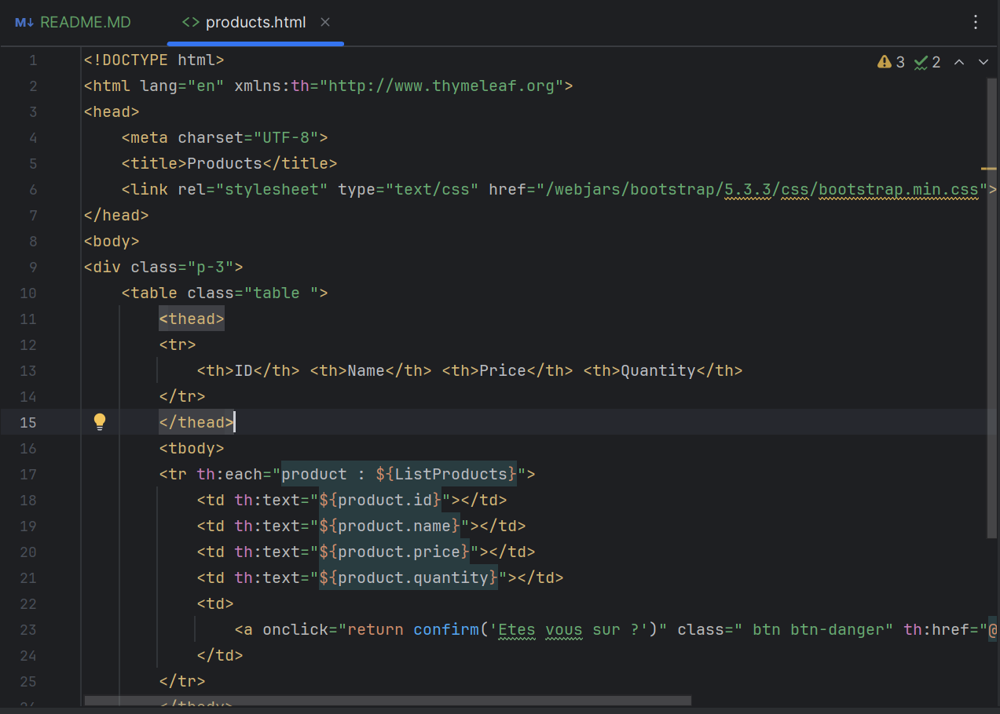

<h2>Atelier 3: Spring MVC avec Thymeleaf</h2>

Dans cet atelier pratique, nous allons créer une petite application de gestion de produits en utilisant Spring MVC avec une architecture orientée rendu HTML côté serveur. Pour cela, nous utiliserons le moteur de templates Thymeleaf

<h4> Creation des Packages</h4>

<h4>Creation de la classe Product</h4>

Pour qu'une classe soit reconnue comme une entité JPA, on ajoute l’annotation @Entity.

<h4>Creation de l'interface ProductRepository</h4>

Pour travailler avec Spring Data JPA, l’interface ProductRepository doit hériter de l’interface générique JpaRepository

<h4>Test de l'application</h4>

Avant de pouvoir tester l'application, nous devons spécifier les informations de connexion à la base de données dans le fichier application.properties.

<h4>NB</h4>

<h4>Ajout des dependances nécessaires</h4>

Si le projet utilise Java 21 ou 23, il est nécessaire d’ajouter explicitement la version de Lombok dans le fichier pom.xml. Sans cela, Lombok risque de ne pas être reconnu correctement par le compilateur, ce qui peut entraîner des erreurs lors de la compilation ou de l’exécution.

<h4>Lancement de L'application dans le navigateur</h4>

Apres execution ,On tape URl suivant "localhost:8086/h2-console"

<h4>Creation du controller dans le package Web</h4>

Déclarer le contrôleur : Pour que la classe soit reconnue comme un contrôleur Spring MVC, il faut l’annoter avec @Controller.

<h4>Creation de la page Product.html</h4>

Pour afficher la liste des produits, on commence par la récupérer depuis la base de données en utilisant la méthode findAll() du ProductRepository. Ensuite, pour transmettre cette liste à la vue, on utilise le modèle Spring MVC. Il suffit de créer un objet de type Model dans le contrôleur et d’ajouter la liste au modèle avec la méthode : "model.addAttribute("listProducts", products)"

<h4>Ajout de la méthode delete dans le contrôleur</h4>

Pour permettre la suppression d’un produit, on ajoute une méthode delete dans la classe ProductController.

